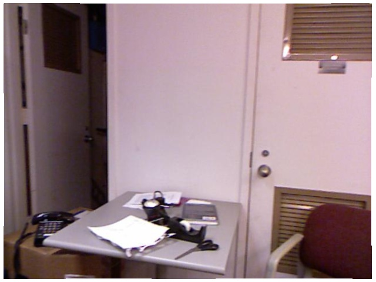
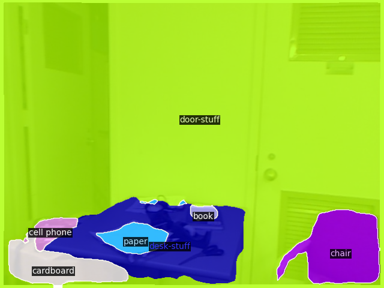

# Focus-SAN


## Description
This is a tools for semantic image prediction based on SAN but limit to specify semantic list. The user can input the source rgb data and the limited colormap. The tool can generate the semantic map.

## Results show

#### -- source rgb data



#### -- unlimited by SAN



#### -- limited by SAN(Occ 11)


## Env setup

Python 3.9.19

```
$ conda env create -n focus_san python=3.9
$ conda activate focus_san
$ pip install -r requirements.txt
```

## Model prepare

Download the san_vit_large_14.pth from [here]() and put it in the checkpoints/.

## QuickStart

    $ git clone https://github.com/Max-luo-song/FocusSAN
    $ cd FocusSAN
    $ python models/sanseg.py --workspace source_dir --output target_dir

Note: Both source_dir and target_dir are folders. Your RGB data are under the source_dir.


## TODO

- [x] Release the project code v1.0
- [ ] Add function: Support more kinds of semantic color list.


This project is based on [https://github.com/chenhaomingbob/LabelMaker](https://github.com/chenhaomingbob/LabelMaker). Thanks a lot!